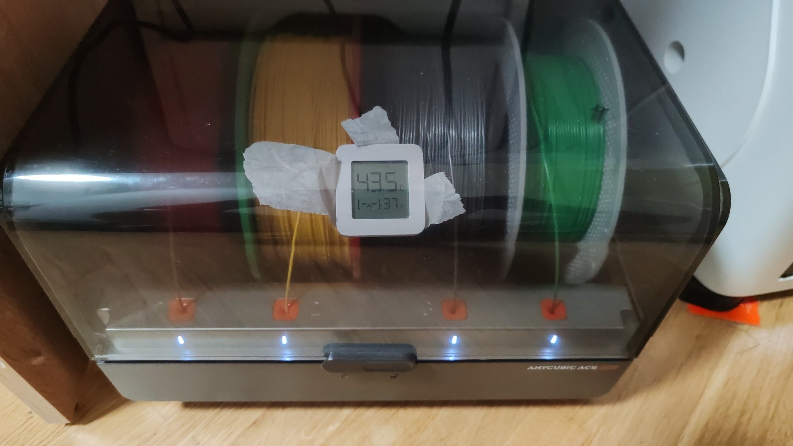
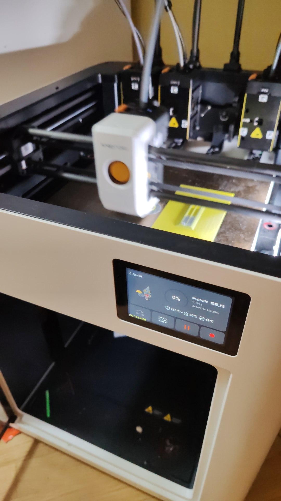
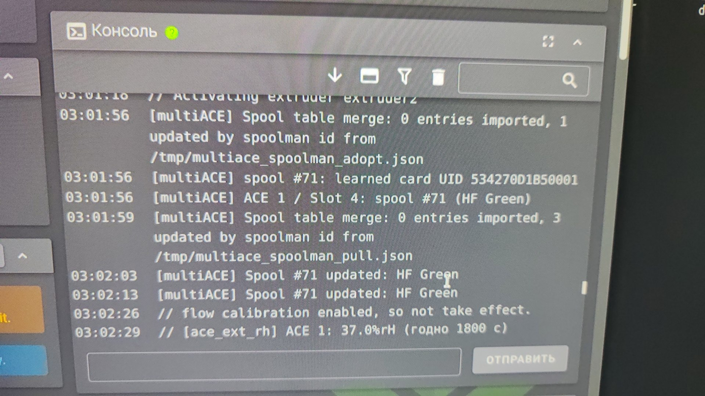

# Автосушка ACE Pro по внешнему датчику влажности

ACE Pro не имеет датчика влажности, поэтому штатная автосушка multiACE для
него выключена. Внешний BLE-датчик Xiaomi LYWSD03MMC (приклеен к крышке камеры,
экраном наружу) измеряет воздух в камере, сервер передаёт показания в Klipper, а решения о нагреве принимает
сам multiACE.

## Фото

**Датчик приклеен к крышке камеры, экраном наружу** — показания видны снаружи
(на снимке 37 %RH):

**Snapmaker U1 с подключённым ACE Pro** (печать идёт, камера 42 °C):

**Консоль: показание внешнего датчика дошло до Klipper** —
`[ace_ext_rh] ACE 1: 37.0%rH (годно 1800 с)`; рядом видно привязку спула по
прочитанной карте (`learned card UID …`):

**Окно выбора катушки: метка прочитана** — «Read RFID», SKU из метки `G00-G00`:

## Части

- `printer/ace_ext_rh.py` — модуль Klipper. Принимает влажность командой
  `ACE_SET_RH`, раз в 60 с сверяет её с порогами multiACE и вызывает его
  же механизм автосушки. `ace.py` не изменяется.
- `feeder/` — контейнер на сервере: читает датчик по BLE и раз в 5 минут
  отправляет значение в Moonraker. Срок годности показания
  (`RH_TTL_SECONDS`) обязан быть не меньше тройного периода опроса
  (`INTERVAL_SECONDS`) — сервис проверяет это при старте и завершается с
  понятной ошибкой, иначе показание протухало бы между опросами и нагрев
  мигал бы циклами длиной в период опроса.
- `esp32-rh/` — необязательный вариант «датчик напрямую в принтер»: ESP32 внутри
  корпуса ACE читает тот же BLE-датчик и сама шлёт `ACE_SET_RH` в Moonraker,
  дублирует показания в MQTT. Нужен, когда сервер с `feeder/` не хочется
  держать рядом с принтером.
- `homeassistant/` — YAML-пакет и дашборд: влажность, температура, возраст
  показания и состояние автосушки.

## Стек

| Слой | Чем сделано |
|---|---|
| Датчик | Xiaomi LYWSD03MMC, **стоковая** прошивка: GATT-подключение, уведомления характеристики `ebe0ccc1-7a0a-4b0c-8a1a-6ff2997da3a6`, 5 байт (темп. int16 LE /100, влажность uint8, батарея uint16 LE мВ). Bindkey из облака Xiaomi не нужен |
| Прошивка на ESP32 (`esp32-rh/`) | C++17, ESP32 (`esp32dev`), фреймворк Arduino (`espressif32@^6.9.0`), PlatformIO; NimBLE-Arduino 1.4.2 (BLE-центр), PubSubClient 2.8 (MQTT), ElegantOTA 3.1.6 (прошивка по воздуху); таблица разделов `min_spiffs`; Unity-тесты на окружении `native` без железа |
| Сервис на сервере (`feeder/`) | Python 3 + `bleak` 3.0.2 поверх BlueZ (D-Bus), Docker Compose, сеть `host`, AppArmor `unconfined` (иначе D-Bus-вызовы bleak блокируются) |
| Принтер (`printer/`) | Klipper — python-модули `ace_ext_rh.py` и `ace_ext_raw.py`; Moonraker HTTP API (`:7125`); multiACE как исполнитель нагрева (`ace.py` не патчится) |
| Автоматизация и графики | Home Assistant (YAML-пакет + дашборд), MQTT (mosquitto `:1883`) |
| Доставка и проверка | SSH (dropbear) через `pexpect` — `scripts/psh.py`, sha256-сверка файла **на принтере** перед `mv`; `scripts/deploy_printer.sh`, `scripts/patch_multiace_ace1.py` |
| Тесты | `pytest` — `tests/` (модули принтера) и `feeder/tests/`; PlatformIO Unity — `esp32-rh/test/` |

## Команды на принтере

    ACE_SET_RH ACE=0 RH=42.5 TTL=1800      подать показание
    ACE_EXT_RH_ENABLE ACE=0 ENABLE=1       включить автосушку
    ACE_EXT_RH_ENABLE ACE=0 ENABLE=0       выключить автосушку
    ACE_EXT_RH_STATUS                      показать состояние

Пороги задаются при включении (`RH_START`, `RH_END`, `TEMP`) и хранятся в
настройках multiACE.

## Автосушка по умолчанию выключена

Сразу после установки автосушка для ACE 0 выключена командой
`ACE_EXT_RH_ENABLE ACE=0 ENABLE=0`. Так и должно оставаться, пока датчик
не закреплён в камере: датчик снаружи показывает влажность комнаты, и
модуль честно попытается высушить воздух в комнате до заданного порога —
чего никогда не произойдёт, и нагрев провисит до десятичасового предела
`ACE_DRY`.

Датчик закреплён: приклеен к крышке камеры, экраном наружу. Когда он на
месте, владелец включает автосушку сам:

    ACE_EXT_RH_ENABLE ACE=0 ENABLE=1

Пороги (`RH_START`, `RH_END`) и температура (`TEMP`) при этом можно не
указывать — тогда используются ранее сохранённые в multiACE значения.

## Безопасность

Нагрев запускается командой с `duration=600` минут — устройство получает
эту команду один раз и само не остановится, даже если Klipper перезапустится
или сервер с датчиком выключится. Поэтому при отсутствии свежих показаний
дольше `TTL` секунд модуль гасит нагрев принудительно: севшая батарейка,
упавший сервер, пропавшая сеть или перезапуск Klipper не оставят сушилку
включённой на все 600 минут без присмотра. Цикл, запущенный вручную
(`ACED__Dry_Start_0` и т. п.), модуль не трогает никогда.

Что из этого подтверждено на живом принтере, а что — только юнит-тестами
(см. отчёт по задаче 10):

- **Подтверждено живьём.** При искусственно заниженном пороге старта
  нагрев включился по показанию внешнего датчика. Затем, ещё до истечения
  заданного `TTL`, на принтере самопроизвольно перезапустился Klipper
  (несвязанная с этим кодом нестабильность USB, подробности в отчёте) —
  модуль `ace_ext_rh` потерял все показания из памяти и на первом же тике
  после перезапуска погасил цикл сушки как «показания нет вовсе», с
  сообщением в журнале `Auto-dry: ACE N done (показание влажности
  протухло)`. Это более суровая проверка, чем штатное истечение `TTL`:
  здесь пропало не только конкретное показание, но и всё состояние
  модуля, а сушка на устройстве к этому моменту была уже реально
  запущена.
- **Покрыто юнит-тестами, но отдельно на живом принтере не
  воспроизводилось**: штатный сценарий, когда Klipper работает
  непрерывно, сервис с датчиком просто перестаёт присылать показания
  (упал, сел аккумулятор, пропала сеть), и модуль гасит нагрев по
  истечении `TTL`, ни разу не теряя собственное состояние. Логика в коде
  та же самая (`fresh_rh` возвращает `None` в обоих случаях), но именно
  эта — более мягкая — ветка живьём отдельно не проверялась.

Остановка не считается выполненной по факту отправки команды. multiACE в
`_auto_dry_stop` снимает владение циклом сразу и не проверяет ответ
устройства, поэтому потерянный на USB пакет оставил бы нагреватель
работать на все 600 минут — и повторить остановку было бы уже некому.
Модуль запоминает каждое своё требование остановки и на следующих тиках
сверяется с фактическим состоянием устройства (`_ace_is_drying`): пока
устройство не подтвердило остановку, команда повторяется каждый тик (до
пяти повторов, то есть около пяти минут), затем в журнал идёт запись уровня
ERROR `[ace_ext_rh] ACE N НЕ ПОДТВЕРДИЛ ОСТАНОВКУ: ...` и повторы
продолжаются раз в десять минут — до подтверждения. Модуль не сдаётся
никогда: сдаться означало бы оставить нагреватель без присмотра.

Обещание «никогда» держится на двух вещах:

- Требования **переживают перезапуск Klipper**. multiACE снятие владения
  сохраняет на диск, поэтому требование, живущее только в памяти, терялось
  бы при любом перезапуске (`FIRMWARE_RESTART`, аварийный останов, ошибка
  конфигурации), и повторять остановку стало бы некому. Состав незакрытых
  требований хранится в `[save_variables]` под именем
  `ace_ext_rh__stop_pending` — **только список индексов**, без текста
  причины: `SAVE_VARIABLE` прогоняет весь файл переменных через
  `configparser` с интерполяцией, а причины содержат знак процента
  (`внешние 34%rH`) и уронили бы запись файла целиком, вместе с
  переменными multiACE. Счётчики повторов намеренно не восстанавливаются —
  новый экземпляр начинает полную серию быстрых повторов.
- Подтверждение принимается **осторожно**: только от устройства, которое
  multiACE считает подключённым, и только на двух тиках подряд. Ответ «не
  сушу» приходит из кэша статусных кадров, и кадр без блока сушилки, равно
  как и первые секунды после переподключения, читаются именно так, хотя
  нагрев идёт; сам multiACE называет это в комментарии ловушкой, однажды
  уже позволившей циклу работать вечно. Ложное подтверждение сняло бы
  требование и снова открыло путь к нагревателю без присмотра.

Единственное исключение из правила «чужой цикл не трогаем»: если ручную
сушку запустить в тот момент, когда наше требование остановки ещё не
подтверждено (устройство отвечает «сушу», и отличить чью сушку оно
выполняет, невозможно), повтор остановки погасит и её. Выбор сознательный:
нагреватель без присмотра на 600 минут опаснее, чем отменённая ручная
сушка, которую видно и можно запустить снова.

Тем же механизмом решается обратный случай: если наш цикл три тика подряд
не сушит (устройство отработало свой 600-минутный предел и погасло само),
модуль отдаёт владение — иначе автоматика залипла бы навсегда, потому что
ветка остановки умеет только гасить, а ветка запуска требует «цикл не наш».

## Совместимость с обновлениями multiACE

Модуль проверяет совместимость с multiACE при каждом запуске Klipper
(`REQUIRED_ACE_ATTRS_STOP`, `REQUIRED_ACE_ATTRS_START` и
`REQUIRED_ACE_ATTRS_CONFIG` в `ace_ext_rh.py`). Обязательные атрибуты
разделены на три группы, потому что последствия их исчезновения разные:

- Пропало нужное для **гашения** (`_auto_dry_stop`, `_auto_dry_for`,
  `_ace_is_drying`, …) — модуль отключается целиком и один раз пишет в
  журнал `[ace_ext_rh] ОТКЛЮЧЁН: multiACE несовместим, отсутствует нужное
  для остановки сушки: ...`. Запускать циклы, которые потом нечем
  погасить, нельзя.
- Пропало нужное только для **запуска** (`_auto_dry_start`,
  `_connected_per_ace`, …) — модуль продолжает работать в режиме **только
  гашение**: таймер регистрируется, новые циклы не запускаются, а циклы,
  запущенные нами раньше, гасятся как обычно. Режим виден в журнале
  (`[ace_ext_rh] готов в режиме ТОЛЬКО ГАШЕНИЕ: ...`) и в
  `ACE_EXT_RH_STATUS`. Полное отключение здесь было бы опаснее: цикл,
  запущенный нами до обновления, multiACE восстановит из своего
  хранилища, а его собственная уборка осиротевших такой цикл не погасит
  (мастер указан и совпадает) — нагрев провисел бы остаток 600 минут.
- Пропало нужное только для **настройки** (`_auto_dry_cfg`,
  `auto_dry_default`) — деградирует одна команда: `ACE_EXT_RH_ENABLE`
  отвечает отказом с причиной, а тик работает как обычно и наши циклы
  гасит. На пути гашения эти атрибуты не участвуют ни одним шагом, поэтому
  отключать из-за них весь модуль значило бы устроить ровно ту опасность,
  против которой разделение и сделано.

В обоих случаях модуль не падает и не ломает работу Klipper: печать,
подача филамента и остальные функции multiACE не затрагиваются. Но
утверждать, что «ничего не затрагивается», можно только про запуск новых
циклов — уже работающий нагрев в режиме только гашения как раз и
затрагивается, намеренно.

## Температура датчика

Датчик Xiaomi LYWSD03MMC паспортно рассчитан на температуру примерно до
60 °C. У владельца сушка настроена на температуру 60 °C — то есть
устройство при сушке будет работать на самой границе своего диапазона.
Это осознанный компромисс: датчик приклеен к крышке камеры, экраном
наружу, — не к нагревателю, но при возможном повышении температуры сушки
держать это в виду стоит.

Поэтому сервис передаёт вместе с влажностью и температуру датчика
(`TEMP=` в `ACE_SET_RH`), а `ACE_EXT_RH_STATUS` показывает её вместе с
возрастом показания. Выше 58 °C команда состояния добавляет строку
`ВНИМАНИЕ: ... температура датчика ... выше 58 C`.

Температура запуска сушки ограничивается потолком устройства
(`max_dryer_temperature` в `[ace]`, на этом принтере 70): multiACE
проверяет потолок только в обработчике своей команды, но не в
`_auto_dry_start`, поэтому понижение потолка иначе не влияло бы на уже
сохранённую температуру автосушки.

## Тесты

    .venv/bin/pytest

## Развёртывание

    ./scripts/deploy_printer.sh                      # модуль на принтер
    python3 scripts/psh.py <<'EOF'                   # перезапуск ПРОЦЕССА klippy
    kill $(ps -ef | grep klippy.py | grep -v grep | awk '{print $2}' | head -1)
    sleep 4
    /etc/init.d/S60klipper start
    EOF
    cd feeder && docker compose up -d --build        # сервис на сервере

`FIRMWARE_RESTART` для обновления модуля НЕ подходит, хотя и выглядит
достаточным: `klippy.py` перезапускается в том же процессе (`main()`
создаёт новый `Printer` в цикле), поэтому модули из `extras` остаются в
`sys.modules` со старым кодом. Проверено 2026-09-26: после доставки файла
и `FIRMWARE_RESTART` команда состояния продолжала отвечать в прежнем
формате, и только перезапуск процесса klippy подхватил новый файл.

Перезапускать именно процессом, а не ветвью `restart` скрипта
`/etc/init.d/S60klipper`. Проверено по тексту скрипта: его ветвь `stop`
снимает питание с главного МК и МК голов
(`lava_io set MAIN_MCU_POWER=0 HEAD_MCU_POWER=0`), а `restart` — это `stop`
плюс `start`. Для перечитывания python-модуля питание МК не при чём, зато
во время печати такое обесточивание её погубит.

Отдельно, чтобы не вводить в заблуждение: 2026-09-26 после такого перезапуска
наблюдалось обнуление `uptime`, то есть перезагрузка всего хоста. Повторить это
не удалось — при последующих перезапусках `uptime` шёл непрерывно. Подтверждено
только снятие питания с МК; перезагрузка хоста остаётся единичным наблюдением
без объяснённого механизма.

Делать только когда принтер не печатает.

`scripts/deploy_printer.sh` и `scripts/psh.py` запускаются системным
`python3`, а не интерпретатором из `.venv` проекта: `psh.py` использует
пакет `pexpect` для работы с паролем по SSH, а в `.venv` он не установлен
(там только зависимости самого проекта — `bleak` и т. п.). Команда:

    python3 scripts/psh.py <<'EOF'
    какая-то команда на принтере
    EOF

## Лицензия

Наш код в этом репозитории — **GPL-3.0**, полный текст в `LICENSE`. Подробнее про
границы: чужие образы прошивки здесь не распространяются, а сторонние проекты
(multiACE, Klipper, Moonraker, OpenCubic CFW) остаются на своих условиях — см.
`NOTICE.md`.
